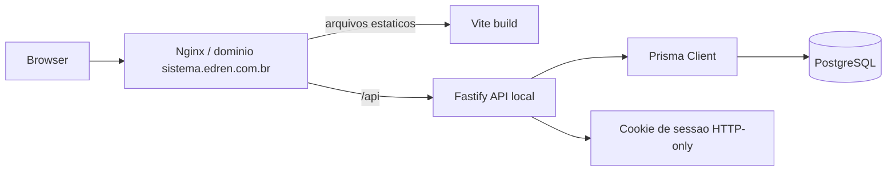

# Arquitetura

## Visao Geral

O projeto e um monorepo TypeScript com separacao entre frontend, backend e pacotes compartilhados. O frontend consome a API pelo mesmo dominio usando prefixo `/api`. O backend centraliza regras de autenticacao, persistencia e futuramente regras de negocio.

## Backend

- `createApp()` monta Fastify com `prismaPlugin`, `cookiePlugin`, rotas de health e rotas de auth.
- Sessao e baseada em token aleatorio armazenado no cookie `edren_session`.
- O token em texto fica apenas no cookie; o banco guarda `tokenHash` SHA-256.
- Senha de usuario e validada com Argon2.
- Rotas de auth retornam usuario serializado com perfil.

## Frontend

- TanStack Router organiza uma rota raiz publica (`/login`) e uma area protegida com `AppShell`.
- `AppShell` consulta `/api/auth/me`; sem usuario, redireciona para `/login`.
- Navegacao principal ja contempla todos os modulos do MVP, mas a maioria esta como placeholder.
- Dashboard consulta `/api/health/db` para mostrar conectividade e contagens de seed.

## Banco

- Schema Prisma ja modela grande parte do MVP, incluindo usuarios, sessoes, configuracoes, catalogo, estoque, clientes, vendas e pagamentos.
- Contas a receber nao tem tabela propria; devem ser calculadas por `Sale.finalAmount - sum(Payment ACTIVE)`.
- Condicional/sacoleira aparecem como tipos de `StockMovement`, conforme decisao de MVP.

## Pontos Arquiteturais Importantes

- Fluxos de venda/estoque precisam ser transacionais no backend.
- Permissoes devem ser aplicadas na API, nao apenas escondidas no frontend.
- `packages/shared` pode concentrar tipos/schemas compartilhados quando as APIs de dominio surgirem.
