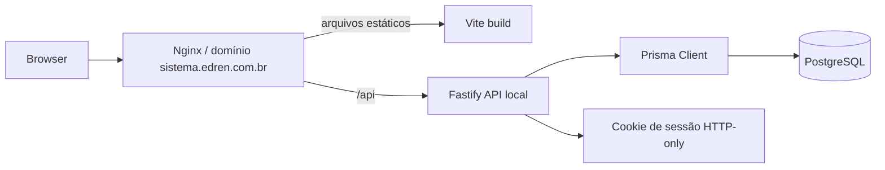

# Arquitetura

## Visão Geral

O projeto é um monorepo TypeScript com separação entre frontend, backend e pacotes compartilhados. O frontend consome a API pelo mesmo domínio usando prefixo `/api`. O backend centraliza regras de autenticação, persistência e futuramente regras de negócio.

## Backend

- `createApp()` monta Fastify com `prismaPlugin`, `cookiePlugin`, rotas de health e rotas de auth.
- Sessão é baseada em token aleatório armazenado no cookie `edren_session`.
- O token em texto fica apenas no cookie; o banco guarda `tokenHash` SHA-256.
- Senha de usuário é validada com Argon2.
- Rotas de auth retornam usuário serializado com perfil.

## Frontend

- TanStack Router organiza uma rota raiz pública (`/login`) e uma área protegida com `AppShell`.
- `AppShell` consulta `/api/auth/me`; sem usuário, redireciona para `/login`.
- Navegação principal já contempla todos os módulos do MVP, mas a maioria está como placeholder.
- Dashboard consulta `/api/health/db` para mostrar conectividade e contagens de seed.

## Banco

- Schema Prisma já modela grande parte do MVP, incluindo usuários, sessões, configurações, catálogo, estoque, clientes, vendas e pagamentos.
- Contas a receber não têm tabela própria; devem ser calculadas por `Sale.finalAmount - sum(Payment ACTIVE)`.
- Condicional/sacoleira aparecem como tipos de `StockMovement`, conforme decisão de MVP.

## Pontos Arquiteturais Importantes

- Fluxos de venda/estoque precisam ser transacionais no backend.
- Permissões devem ser aplicadas na API, não apenas escondidas no frontend.
- `packages/shared` pode concentrar tipos/schemas compartilhados quando as APIs de domínio surgirem.
- Módulos de API devem manter rotas finas quando a regra de negócio crescer: rota valida entrada/autorização, serviço aplica regra, repositório encapsula acesso Prisma quando houver reuso ou transação.
- O frontend deve evitar rotas com muitas responsabilidades; páginas podem orquestrar dados, mas formulários, listas, detalhes e componentes de domínio devem ficar em arquivos próprios quando passarem a ser reutilizados ou ultrapassarem uma complexidade clara.
- Tipos e funções de API no frontend devem ser organizados por domínio antes da entrada de estoque/vendas para reduzir acoplamento em `apps/web/src/lib/api.ts`.
