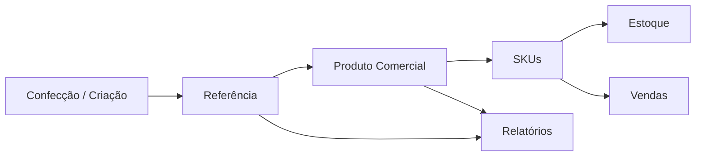

# Design de Módulos, Referência e Caderno de Produtos

**Situação:** Planejada.
**Rastreabilidade:** `spec.md`; `docs/context/CADERNO_PRODUTOS_EDREN.md`; `products-and-collections`.

## Decisão Central

O sistema deve assumir uma estrutura modular. A referência é a identidade operacional da peça, mas cada módulo usa essa identidade com uma responsabilidade diferente.

- **Confecção/Criação:** desenvolve, calcula, registra croqui e prepara fabricação.
- **Loja/Catálogo:** transforma a referência em produto vendável com preço, coleção, grade, SKUs, foto pronta e estoque.
- **Estoque:** controla quantidade por SKU e local.
- **Vendas:** usa referência e SKU para localizar e vender peças.
- **Relatórios:** consolida desempenho por referência, produto, coleção, estoque e venda.

Módulo também significa contexto de acesso. Cada módulo deve declarar quais perfis podem ver, criar, editar ou executar ações sensíveis naquele contexto.

## Por Que Separar Em Módulos

O caderno mostra que a EDREN não começa pelo produto pronto. A peça nasce na confecção, passa por desenho, material, custo, piloto e aprovação. Já a loja precisa de outro conjunto de informações: preço, coleção, SKUs, estoque e foto comercial.

Se tudo ficar em uma única tela de produto, o cadastro fica pesado e mistura dois momentos diferentes. Se a referência for tratada apenas como campo comercial, o sistema perde o comportamento produtivo que existe no caderno.

A separação modular permite que o MVP mantenha o fluxo comercial já implementado e abra espaço para registrar o nascimento da peça sem burocratizar a venda.

## Modelo Conceitual

## Papel da Referência

A referência deve ser tratada como elo entre o universo produtivo e o universo comercial.

Na prática:

- antes da aprovação, ela identifica uma peça em desenvolvimento;
- depois da aprovação, ela identifica o produto comercial vendido pela loja;
- nos relatórios, ela permite cruzar criação, custo, estoque e venda;
- no atendimento, ela continua sendo o código conhecido pela EDREN para localizar a peça.

## Módulo Confecção/Criação

Responsabilidade: registrar a peça enquanto ela ainda está nascendo.

Dados principais:

- referência;
- status de desenvolvimento;
- croqui ou imagem do desenho;
- observações de modelagem, acabamento e ajuste;
- tecido, metragem, forro, zíper, botões, alça e outros materiais;
- costura, mão de obra, plaquinha, tag e serviços;
- custo calculado;
- vínculo futuro ou atual com produto comercial.

Estados sugeridos:

- `DRAFT`: referência criada com dados mínimos;
- `IN_DEVELOPMENT`: peça em desenvolvimento/custo em construção;
- `APPROVED`: peça aprovada para virar produto comercial;
- `PROMOTED`: já associada a produto comercial.

Esses nomes são técnicos candidatos. A UI deve exibir textos em português.

## Contextos e Acesso Por Perfil

Perfis existentes no MVP:

- `ADMIN`: administradora/dona ou pessoa com responsabilidade total pelo sistema.
- `MANAGER`: gerente ou pessoa de confiança operacional, quando o perfil for usado nas telas de negócio.
- `SELLER_OPERATOR`: vendedora ou operadora de loja, focada em consulta, venda e rotinas sem acesso a custo interno.

Nomes técnicos exatos devem seguir os perfis seedados no banco. A UI deve exibir nomes em português.

### Matriz Inicial

| Contexto | ADMIN | MANAGER | SELLER_OPERATOR |
| --- | --- | --- | --- |
| Confecção/Criação | cria, edita, vê custo, aprova e promove | consulta opcional se habilitado pela EDREN | sem acesso por padrão |
| Loja/Catálogo | cria, edita, vê custo, altera preço e SKUs | consulta catálogo; usa em estoque/venda | consulta produtos ativos; usa em venda |
| Estoque | ajusta e movimenta conforme regras administrativas | movimenta conforme fluxo permitido | consulta e movimenta apenas em fluxos permitidos, se aplicável |
| Vendas | vende, cancela conforme regra, vê recebíveis quando permitido | vende e aplica desconto permitido | vende e consulta produtos, sem alterar preço cadastrado |
| Relatórios | vê relatórios incluindo custos e recebíveis administrativos | vê relatórios operacionais definidos | acesso limitado ou sem acesso, conforme necessidade |

Esta matriz é ponto de partida. Ela não cria permissões customizadas por usuário e não substitui validações específicas de cada feature.

### Regras de Contexto

- A API deve validar permissão por ação, mesmo quando a UI esconder o acesso.
- A navegação deve evitar mostrar módulos sem acesso para o perfil logado, exceto quando houver motivo claro para exibir bloqueado.
- Custo detalhado de Confecção e custo do Produto devem ser ocultados de perfis de venda por padrão.
- Vendedora/operadora deve ter acesso rápido à referência no contexto de venda, não ao caderno de criação.
- Administradora deve conseguir transitar entre contexto de criação e produto comercial quando houver vínculo.
- Gerente é um perfil intermediário: pode precisar de consulta operacional, mas alterações sensíveis continuam restritas a `ADMIN` no MVP.

## Módulo Loja/Catálogo

Responsabilidade: manter o produto pronto para venda.

Dados principais já cobertos por `products-and-collections`:

- referência comercial única;
- nome do produto;
- coleção;
- categoria;
- grade de tamanho;
- preço de venda;
- custo opcional;
- imagem principal/foto pronta;
- SKUs por cor e tamanho;
- status ativo/inativo.

Este módulo não deve exigir croqui, ficha de materiais ou custo detalhado para vender. Esses dados pertencem ao contexto de Confecção/Criação e podem ser acessados por vínculo quando existirem.

## Promoção Para Produto Comercial

A promoção deve ser explícita. Ela não é o mesmo que editar uma referência incompleta até virar produto sem marco claro.

Fluxo recomendado:

1. Usuária cria referência no módulo Confecção/Criação com poucos dados.
2. Usuária adiciona croqui, observações e itens de custo quando fizer sentido.
3. Usuária marca a referência como aprovada.
4. Sistema abre o fluxo de criação de produto comercial reaproveitando referência e custo calculado quando disponíveis.
5. Usuária completa os campos comerciais obrigatórios: nome, coleção, categoria, grade e preço.
6. Sistema cria ou associa o produto comercial e marca a referência como promovida.

Regras:

- a referência não deve ser promovida sem respeitar as validações comerciais existentes;
- o custo calculado pode preencher ou sugerir o custo opcional do produto;
- a promoção não deve apagar croqui, itens de custo ou observações;
- uma referência promovida deve apontar para exatamente um produto comercial no fluxo padrão;
- se a equipe decidir permitir associação a produto já existente, essa ação deve validar duplicidade e preservar histórico.

## Navegação e UI

Entrada principal recomendada:

- menu **Confecção** ou **Criação** para referências em desenvolvimento;
- menu **Produtos** para catálogo vendável já existente.

Na tela de Confecção/Criação:

- botão primário para criar referência rápida;
- listagem por referência, status, custo calculado e indicação de croqui;
- detalhe com seções simples para croqui, observações e custos;
- ação clara para promover para produto quando estiver aprovada.

Na tela de Produto:

- manter o foco comercial atual;
- exibir, quando houver vínculo, um acesso para ver dados de criação;
- não misturar todos os campos do caderno no formulário principal de produto.

## Encaixe no Desenvolvimento

Ordem recomendada de implementação:

1. Refatorar a camada de catálogo conforme `catalog-api-service-layer`, porque promoção de referência vai reutilizar validações de produto, coleção e SKU.
2. Decompor a UI de produtos conforme `product-ui-decomposition`, reduzindo risco antes de adicionar vínculo com criação.
3. Implementar o módulo Confecção/Criação com CRUD mínimo de referência, imagem de croqui e itens de custo.
4. Implementar promoção para produto comercial usando os serviços do catálogo.
5. Adicionar vínculo visual entre Produto e Referência de Criação.

Essa ordem evita mexer no fluxo comercial validado antes de separar responsabilidades técnicas.

## Impacto Nas Specs Existentes

`products-and-collections` continua válida para produto vendável. O ajuste conceitual é que ela cobre o módulo Loja/Catálogo, não todo o ciclo de vida da peça.

`catalog-api-service-layer` ganha importância porque a promoção de referência para produto não deve duplicar regras de produto dentro do módulo de Confecção/Criação.

`stock`, `sales` e `reports` devem depender do produto comercial e SKUs. Eles podem exibir referência e acessar dados de criação por vínculo, mas não devem depender da ficha de confecção para operar venda ou estoque no MVP.

## Fora de Escopo do Design Atual

- Ordem de produção completa.
- Controle de corte, pilotagem e etapas produtivas detalhadas.
- Baixa automática de materiais usados na confecção.
- Compra de matéria-prima.
- Cálculo automático de preço por margem.
- Múltiplas versões produtivas da mesma referência.

## Pontos A Decidir Antes Da Implementação

- Nome final do módulo na UI: **Confecção**, **Criação** ou **Caderno**.
- Namespace final da API.
- Se a referência pode nascer sem número oficial ou se sempre deve receber a referência manual definitiva desde o início.
- Se a promoção cria sempre um produto novo ou também pode associar uma referência de criação a produto comercial já cadastrado.
